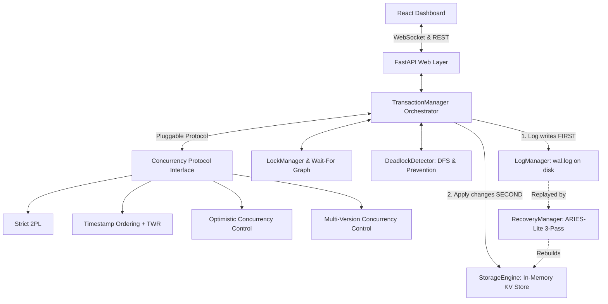

# Database Transaction Manager Simulator

A comprehensive, first-principles academic database transaction manager simulator built for a graduate/undergraduate DBMS course. This project implements transaction management, concurrency control, granular locking, deadlock resolution, write-ahead logging (WAL), and crash recovery from scratch — with **zero external database engines** (no SQLite, MySQL, Postgres, or ORMs). The in-memory storage engine is a custom key-value store, and durability is achieved solely via an append-only Write-Ahead Log file on disk.

---

## Architecture Overview



---

## Theory-to-Code Mapping

This simulator is explicitly designed to reflect database textbook theory in direct, readable Python implementations.

| DBMS Textbook Concept | Source File & Class/Function | Theoretical Mechanism & Implementation Detail |
| :--- | :--- | :--- |
| **Raw Storage (Uncached Disk/Pages)** | [`backend/app/storage_engine.py`](file:///C:/Users/Anaitha%20Rajesh/.gemini/antigravity/scratch/dbms-simulator/backend/app/storage_engine.py)<br>`StorageEngine` | Dict-backed thread-safe store with `get`, `put`, `delete`, and atomic `snapshot()`. Has zero transaction awareness. |
| **Write-Ahead Logging (WAL Invariant)** | [`backend/app/log_manager.py`](file:///C:/Users/Anaitha%20Rajesh/.gemini/antigravity/scratch/dbms-simulator/backend/app/log_manager.py)<br>`LogManager.append`, `log_write` | Appends log records with monotonic LSN, `prev_lsn` backward chains, old/new values, and forces physical disk sync via `os.fsync()`. In [`transaction_manager.py`](file:///C:/Users/Anaitha%20Rajesh/.gemini/antigravity/scratch/dbms-simulator/backend/app/transaction_manager.py), `log_write()` strictly precedes `storage_engine.put()`. |
| **Shared & Exclusive Lock Management** | [`backend/app/lock_manager.py`](file:///C:/Users/Anaitha%20Rajesh/.gemini/antigravity/scratch/dbms-simulator/backend/app/lock_manager.py)<br>`LockManager.acquire`, `release` | Per-key S and X locks with compatibility matrix and lock upgrade (S $\rightarrow$ X). Thread synchronization via `threading.Condition`. Maintains dynamic Wait-For Graph ($T_i \rightarrow T_j$). |
| **Strict Two-Phase Locking (Strict 2PL)** | [`backend/app/concurrency/two_phase_locking.py`](file:///C:/Users/Anaitha%20Rajesh/.gemini/antigravity/scratch/dbms-simulator/backend/app/concurrency/two_phase_locking.py)<br>`StrictTwoPhaseLocking` | Growing phase: acquires S locks for reads, X locks for writes. Shrinking phase: strict rule — all locks are held until transaction commits or aborts, eliminating cascading aborts and ensuring conflict serializability. |
| **Basic Timestamp Ordering (BTO)** | [`backend/app/concurrency/timestamp_ordering.py`](file:///C:/Users/Anaitha%20Rajesh/.gemini/antigravity/scratch/dbms-simulator/backend/app/concurrency/timestamp_ordering.py)<br>`TimestampOrdering.before_read`, `before_write` | Maintains $R\_TS(X)$ and $W\_TS(X)$ per key. Aborts older read operations arriving after a younger write ($TS(T) < W\_TS(X)$) and older write operations arriving after a younger read ($TS(T) < R\_TS(X)$). |
| **Thomas Write Rule (TWR)** | [`backend/app/concurrency/timestamp_ordering.py`](file:///C:/Users/Anaitha%20Rajesh/.gemini/antigravity/scratch/dbms-simulator/backend/app/concurrency/timestamp_ordering.py)<br>`TimestampOrdering.before_write` | If $TS(T) < W\_TS(X)$, rather than aborting, the obsolete write is safely **ignored** (`is_write_ignored() == True`), preserving serializability without unnecessary aborts. |
| **Optimistic Concurrency Control (OCC)** | [`backend/app/concurrency/occ.py`](file:///C:/Users/Anaitha%20Rajesh/.gemini/antigravity/scratch/dbms-simulator/backend/app/concurrency/occ.py)<br>`OptimisticConcurrencyControl` | Kung-Robinson three-phase protocol: (1) Read phase (writes buffered in private local workspace), (2) Validation phase at commit (backward validation against committed transactions: $WriteSet(T_c) \cap ReadSet(T) \neq \emptyset$), (3) Write phase flushing private buffer to WAL and storage. |
| **Multi-Version Concurrency Control (MVCC)** | [`backend/app/concurrency/mvcc.py`](file:///C:/Users/Anaitha%20Rajesh/.gemini/antigravity/scratch/dbms-simulator/backend/app/concurrency/mvcc.py)<br>`MultiVersionConcurrencyControl` | Creates version tuples `(txn_id, created_ts, expired_ts, value)`. Snapshot isolation: reads visible version as of start timestamp. Readers never block writers; writers never block readers. First-committer-wins write-write conflict prevention. |
| **MVCC Time-Travel Queries** | [`backend/app/concurrency/mvcc.py`](file:///C:/Users/Anaitha%20Rajesh/.gemini/antigravity/scratch/dbms-simulator/backend/app/concurrency/mvcc.py)<br>`get_version_at(key, target_ts)` | Queries historical snapshot of any key as of any arbitrary past logical timestamp by traversing the version chain. |
| **Deadlock Detection (DFS Cycle Search)** | [`backend/app/deadlock_detector.py`](file:///C:/Users/Anaitha%20Rajesh/.gemini/antigravity/scratch/dbms-simulator/backend/app/deadlock_detector.py)<br>`find_cycles`, `DeadlockDetector` | Background thread polling Wait-For Graph using 3-color Depth-First Search. Reused directly by Serializability Precedence Graph checker. |
| **Deadlock Victim Selection** | [`backend/app/deadlock_detector.py`](file:///C:/Users/Anaitha%20Rajesh/.gemini/antigravity/scratch/dbms-simulator/backend/app/deadlock_detector.py)<br>`_select_victim` | Supports swappable policies: (1) `youngest` (highest timestamp/ID), (2) `fewest_locks` (minimum locks currently held). |
| **Deadlock Prevention: Wound-Wait & Wait-Die** | [`backend/app/lock_manager.py`](file:///C:/Users/Anaitha%20Rajesh/.gemini/antigravity/scratch/dbms-simulator/backend/app/lock_manager.py)<br>`LockManager.acquire` | Non-preemptive (Wait-Die: older waits, younger dies) and preemptive (Wound-Wait: older wounds younger, younger waits) timestamp-based prevention schemes evaluated at lock-request time. |
| **ARIES-Lite 3-Pass Crash Recovery** | [`backend/app/recovery_manager.py`](file:///C:/Users/Anaitha%20Rajesh/.gemini/antigravity/scratch/dbms-simulator/backend/app/recovery_manager.py)<br>`RecoveryManager.recover` | Three genuine passes: (1) **Analysis Pass** (identifies winners vs active losers), (2) **Redo Pass** (repeats history forward to restore crash-point state), (3) **Undo Pass** (scans backward rolling back losers using old values and writing CLRs). |
| **Conflict-Serializability & Precedence Graph** | [`backend/app/serializability.py`](file:///C:/Users/Anaitha%20Rajesh/.gemini/antigravity/scratch/dbms-simulator/backend/app/serializability.py)<br>`check_serializability` | Parses arbitrary schedule strings, identifies WR, RW, and WW conflict dependencies, constructs precedence graph, runs DFS cycle detection, and performs Kahn's topological sort for equivalent serial order. |
| **Isolation Level Anomaly Laboratory** | [`backend/app/scenarios/isolation_scenarios.py`](file:///C:/Users/Anaitha%20Rajesh/.gemini/antigravity/scratch/dbms-simulator/backend/app/scenarios/isolation_scenarios.py) | Reproducible step-by-step simulations of Dirty Read, Non-Repeatable Read, Lost Update, and Phantom Read across ANSI SQL isolation levels. |

---

## Formal Correctness Arguments

### 1. Strict Two-Phase Locking Guarantees Conflict Serializability

**Theorem**: *Any schedule produced by Strict Two-Phase Locking (Strict 2PL) is conflict serializable and avoids cascading aborts.*

**Proof Argument**:
1. In Strict 2PL, a transaction cannot acquire any new lock after releasing any lock (Two-Phase property), and furthermore holds all exclusive (and shared) locks until the transaction completes (`COMMIT` or `ABORT`).
2. Suppose for contradiction that the serialization graph (precedence graph) contains a directed cycle: $T_1 \rightarrow T_2 \rightarrow \dots \rightarrow T_k \rightarrow T_1$.
3. An edge $T_i \rightarrow T_j$ implies that $T_i$ accessed a data item $X$ before $T_j$ accessed $X$ in a conflicting mode. Under Strict 2PL, $T_i$ must acquire the lock on $X$ and cannot release it until $T_i$ commits.
4. Therefore, $T_j$ cannot acquire the conflicting lock on $X$ until $T_i$ has committed:
   $$\text{CommitTime}(T_i) < \text{LockAcquired}(T_j) < \text{CommitTime}(T_j)$$
5. Propagating this along the cycle yields:
   $$\text{CommitTime}(T_1) < \text{CommitTime}(T_2) < \dots < \text{CommitTime}(T_k) < \text{CommitTime}(T_1)$$
   This implies $\text{CommitTime}(T_1) < \text{CommitTime}(T_1)$, an impossibility.
6. Thus, the precedence graph is acyclic, proving the schedule is **conflict serializable**.
7. Because uncommitted dirty writes are protected by exclusive locks held until commit, no transaction can read uncommitted values, guaranteeing the schedule is **Recoverable** and **Avoids Cascading Aborts (ACA)**. $\blacksquare$

### 2. Write-Ahead Logging (WAL) Invariant Guarantees Crash Durability

**Theorem**: *Enforcing disk-write sequencing (log entry flushed before data update) guarantees atomicity and durability under unexpected crashes.*

**Proof Argument**:
1. Let an update operation write new value $V_{new}$ to item $X$ whose prior value was $V_{old}$.
2. The WAL protocol requires:
   $$\text{DiskFlush}(\text{LogRecord}(lsn, T, \text{WRITE}, X, V_{old}, V_{new})) \prec \text{MemoryUpdate}(X \leftarrow V_{new})$$
3. Consider a system crash occurring at any arbitrary instant:
   - **Case A (Crash occurs before log flush)**: Neither the log record nor the uncommitted data on disk reflects the change. On recovery, the transaction has no commit record and no incomplete log record; storage retains $V_{old}$. Atomicity holds.
   - **Case B (Crash occurs after log flush but before commit)**: The log on disk contains the `WRITE` record with $V_{old}$, but no `COMMIT` record. The Analysis pass categorizes $T$ as a "loser". The Redo pass repeats history, and the Undo pass reads $V_{old}$ from the log and restores $X \leftarrow V_{old}$. Atomicity holds.
   - **Case C (Crash occurs after commit record is flushed)**: The log contains `COMMIT`. The Analysis pass categorizes $T$ as a "winner". The Redo pass ensures $V_{new}$ is applied. Durability holds. $\blacksquare$

---

## Quick Start Guide

### Prerequisites
- Python 3.11+
- Node.js 18+ and npm

### 1. Start the Backend
```bash
cd backend
python -m pip install -r requirements.txt
python run_server.py
```
Backend runs at `http://localhost:8000`. Interactive OpenAPI documentation is available at `http://localhost:8000/docs`.

### 2. Run the Full Test Suite
```bash
cd backend
python -m pytest tests -v
```

### 3. Run Standalone CLI Demonstration
```bash
cd backend
python demo_cli.py
```

### 4. Start the Frontend Dashboard
```bash
cd frontend
npm install
npm run dev
```
Open `http://localhost:5173` in your browser.

---

## Dashboard Capabilities

1. **Live Control Room**:
   - Real-time transaction runner (custom transactions or preset contention scenarios).
   - Live transaction status badges (`RUNNING`, `WAITING`, `COMMITTED`, `ABORTED`, `RETRYING`).
   - Live streaming WAL viewer with color-coded operations and old/new values.
   - In-memory key-value storage view.
   - Dynamic protocol and deadlock mode switching without restarting.
2. **Wait-For Graph Visualizer**:
   - Interactive force layout showing lock waiting dependencies.
   - Detected deadlock cycles automatically turn crimson red with pulsating indicators.
   - Victim selection diagnosis detailing chosen transaction, policy rationale, and resolution.
3. **Isolation Level Playground**:
   - Interactive execution of Dirty Read, Non-Repeatable Read, Lost Update, and Phantom Read.
   - Side-by-side comparison between weak isolation levels and Serializable mode.
4. **Serializability Checker**:
   - Form accepting arbitrary schedules in standard DBMS notation (`r1[x] w2[x] r1[y] w1[x] c1 c2`).
   - Conflict table classifying WR, RW, and WW dependencies.
   - Precedence graph visualization with cycle detection and topological sorting.
5. **MVCC Time-Travel Panel**:
   - Visual inspectable version chains for each key.
   - Timestamp slider allowing arbitrary point-in-time snapshot queries.
6. **Chaos Testing & Crash Recovery**:
   - Mid-workload crash trigger that erases volatile memory while keeping disk WAL intact.
   - Interactive ARIES 3-pass recovery playback (Analysis $\rightarrow$ Redo $\rightarrow$ Undo).
   - Before/after storage diff verifying zero data loss.
7. **Benchmark Dashboard**:
   - Multi-metric Recharts comparison across all 4 concurrency protocols.
   - Deadlock Detection vs Prevention (Wound-Wait vs Wait-Die) trade-off analysis.

---

## Known Limitations & Future Work

- **Single-Node In-Memory**: Designed specifically for a single database node. Does not implement distributed consensus (Paxos/Raft) or Two-Phase Commit (2PC).
- **Page-Level Buffer Pool**: The storage engine operates at key-value granularity rather than slotted disk pages with a LRU/CLOCK buffer pool manager.
- **Predicates in Phantom Testing**: Phantom reads in this simulator are demonstrated via aggregate key count queries rather than B+ Tree index range locks or next-key locks.
